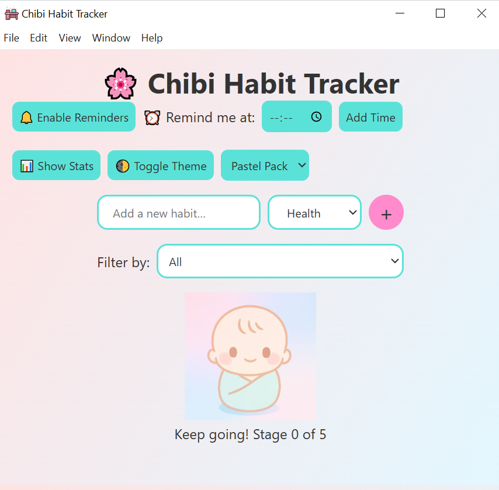

# 🌸 Chibi Habit Tracker

A delightful desktop habit‐tracker built with **Electron**, featuring cute chibi growth stages, custom reminders, streak badges, and more!



---


## 🚀 Download

Because our installer is larger than GitHub’s release‐asset limits, you can grab the latest Windows installer from Google Drive:

- **Installer (v1.0.0)**  
  👉 [Download Chibi Habit Tracker Setup 1.0.0] (https://drive.google.com/file/d/131DSuQHliujrfsxP1g1yLtfxL_lQ5No0/view?usp=drive_link)

---

## ✨ Features

- **Chibi Growth**: Your little chibi “grows” as you log habits  
- **Custom Reminders**: Pick one or more times per day for notifications  
- **Habit Categories & Filtering**: Tag each habit (Health, Work, Learning…) and filter your list  
- **Drag-to-Reorder**: Prioritize with drag & drop  
- **Streaks & Badges**: Track consecutive days and earn 7-day or 30-day badges + confetti  
- **Dark & Light Themes** plus “Classic,” “Pastel,” and “Neon” skins  
- **Stats Dashboard**: Weekly completions bar chart with Chart.js  
- **PWA-friendly**: Offline‐first service worker for reminders  

---

## 📦 Installer Installation

1. Download the `.exe` from the link above.  
2. Run the installer (`Chibi Habit Tracker Setup 1.0.0.exe`).  
3. Follow the on-screen prompts to complete installation.  
4. Launch “Chibi Habit Tracker” from your Start menu or desktop shortcut.  

---

## 🛠 Development

If you’d like to run or build from source:

 1. Clone this repo
```
git clone https://github.com/Khushi0389/Chibi-Habit-Tracker.git
cd Chibi-Habit-Tracker
```

 2. Install dependencies
```
npm install
```

 3. Launch in development mode
```
npm start
```


# 🤝 Contributing
- PRs, issues, and feature requests are welcome! Please:

- Fork the repo

- Create a feature branch (git checkout -b feat/your-idea)

- Commit your changes (git commit -m "feat: your idea")

- Push and open a pull request.

